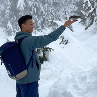

Currently, I'm an engineer at [Tesla AI](https://www.tesla.com/ai), where I convince cars to drive themselves.
In my past academic life, I studied [Engineering Science](https://engsci.utoronto.ca/) at the University of Toronto where I majored in Electrical and Computer Engineering.
My primary interests are in robotics, machine learning, distributed systems, optimization, and reliability.
In short, I build _useful_ things that 1) work, 2) work well, and 3) work well together.

Some of my past experiences include:

- Being the first engineer at a startup @ [kortex](https://www.kortex.co/) (now [eden.so](https://eden.so/))
- Upside-down reinforcement learning @ [TISL](https://tisl.cs.utoronto.ca/), co-supervised by NVIDIA research
- Autoscaling, production engineering, and memory optimization @ [Uber](https://www.uber.com/en-US/blog/engineering/)
- [ROS](https://www.ros.org/) for the NASA [VIPER](https://www.nasa.gov/viper) lunar rover @ [Open Robotics](https://openrobotics.org/) (now under Alphabet)
- [Memristor](https://en.wikipedia.org/wiki/Memristor) ML Acceleration @ [ISML](https://www.eecg.utoronto.ca/~roman/)
- Autonomous vehicles @ [aUToronto](https://www.autodrive.utoronto.ca/)

### Connect with me:

- Email: `brianchen.chen (at) alumni.utoronto.ca`
- Github: [github.com/ihasdapie](https://github.com/ihasdapie)
- Google Scholar: [scholar.google.com](https://scholar.google.com/citations?hl=en&user=1fvqKyoAAAAJ)
- LinkedIn: [linkedin.com/in/brianchen28914](https://www.linkedin.com/in/brianchen28914/)

  
Other

### Other

- Fun fact: I have an Erdős number of 4. Not particularly impressive, but I think it's pretty cool that I have one.

> Q: How can you tell if someone uses Linux?  
> A: They'll tell you.

I'm currently on ~~Manjaro~~ ~~Tumbleweed~~ Arch!

> Q: How can you tell if a someone uses ~~vim~~ [nvim](https://github.com/ihasdapie/dotfiles)  
> A: They'll tell you.

(courtesy of my good friend Matthew)

