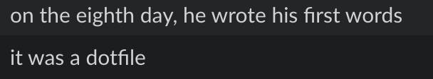

## What am I up to right now?
- Incoming @ Tesla Autopilot
- Research @ [TISL](https://tisl.cs.utoronto.ca/), co-supervised by nvidia research
- Trying to get through university :)

##  Connect with me:

- Email: `brianchen.chen (at) mail.utoronto.ca`
- [Github](https://github.com/ihasdapie)

## Some things I've worked on in the past:
- ProdEng @ Uber
- Autopilot @ Tesla
- SWE @ [Open Robotics](https://openrobotics.org/) (Now an Alphabet company)
    - Got to work on NASA's [VIPER](https://www.nasa.gov/viper) lunar rover!
- Research @ [ISML](https://www.eecg.utoronto.ca/~roman/)
    - Accelerating machine learning tasks on memristor crossbars
- Teaching cars to drive themselves @ [aUToronto](https://www.autodrive.utoronto.ca/)
- [TA]()-ing data structures & algorithms (ESC180/ESC190)
- Building [discoverparks.ca](discoverparks.ca) for [BC Parks Foundation](https://bcparksfoundation.ca/).  ([cool discoverparks ad at YVR](./bcpf_dp_ad.jpg))
- [Making pretty notes]()
- Helping people shop for groceries more safely during COVID-19 with [grocercheck.ca](https://grocercheck.ca/)
- [And more]()

> For more details, see my [projects page]() or [contact me]()

<!--
## Resume


  
View as image

  }}/resume.png" alt="Resume" style="width:100%">

 

If the PDF preview doesn't work for you, you may download it instead by clicking on [this link](/resume.pdf). -->

## Misc

Fun fact: I have an Erdős number of 4. Not particularly impressive, but I think it's cool.

> Q: How can you tell if someone uses Linux?  
> A: They'll tell you.

I'm currently on ~~Manjaro~~  [^1] ~~Tumbleweed~~ [^2] Arch!

[^1]: I'll probably write something up about this sometime
[^2]: Tumbleweed broke on me. Back to Arch I go :/

> Q: How can you tell if a programmer uses Vim?  
> A: You guessed it -- they'll tell you.

Excuse me, I use [nvim](https://github.com/ihasdapie/dotfiles).

#### About this page
This site's design was inspired by the great minds behind [bettermotherfuckingwebsite.com](http://bettermotherfuckingwebsite.com/). 
If you would like to also like to have a site that *isn't an absolute eyesore* and *doesn't load a 40-pound jQuery file*, check out the [hugo theme](https://github.com/ihasdapie/bettermotherfuckinghugowebsite/) behind this website. 
Also, it is [more eco-friendly](https://www.websitecarbon.com/website/chenbrian-ca/)!

