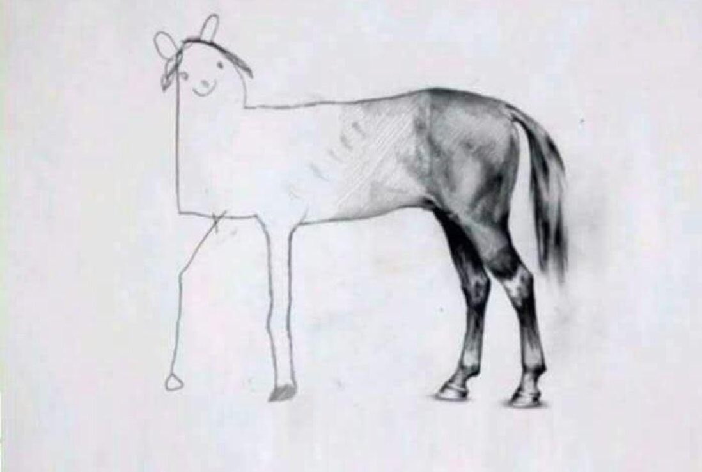

A few weeks back one of my roommates mentioned in passing that they were thinking of writing conway's game of life as a little widget for their website.
I thought that was pretty fun and suggested that it would be really neat if it were in 3D as well.  
<br>
... anyways fast-forward about two hours and I was stuck in a 3-hour lecture.
So I wrote it (as is pretty evident below)

<script type="module" src="conway.js" type="text/javascript"> </script>


> Disclaimer: I don't think I can claim to be a *good* JS programmer so I highly doubt this can be considered "exemplary" javascript code.
> For example I added parallax to it in a way that definitely wasn't accidental...let's call it a "feature", not a "bug".

Additional features that are half-baked currently include changing the initial state of the game, game size, etc. 
It's the kind of thing that I *had* the intention of doing while writing it but kind of got bored after I got the minimum viable product working.
I'd also like to note that [Three.js](https://threejs.org/) was surprisingly performant and ergonomic to use (though maybe my use-case was just really simple).
The main intent was to have a swanky little widget I can stick on this site so that I can prove that i cAn fRoNt-EnD tOo[^sortof] because recruiters seem to think otherwise -- even though the bulk of my worked experience is probably fullstack [^horse].
Maybe I'm not macintosh™ enough to write `css`.

[^sortof]: sort of. 
[^horse]: Fullstack developers: 

Anyways, it's easily embeddable by copying the appropriate files over ([repo](https://github.com/ihasdapie/conway3d)) and adding a `script` tag to where you want this to show up:


```js
<script type="module" src="conway.js" type="text/javascript"> </script>
```


### TODO:
- Add a way to change the initial state of the game
- game grid resizing
- interactive camera control
- better developer api
- optimizing it ([abrash's black book, ch 17, 18](http://www.jagregory.com/abrash-black-book/#chapter-17-the-game-of-life)) [^abrash]

[^abrash]: the abrash black book's section on optimization is a genuinely fascinating read.

<br>

> Source code: [github.com/ihasdapie/conway3d](https://github.com/ihasdapie/conway3d)

