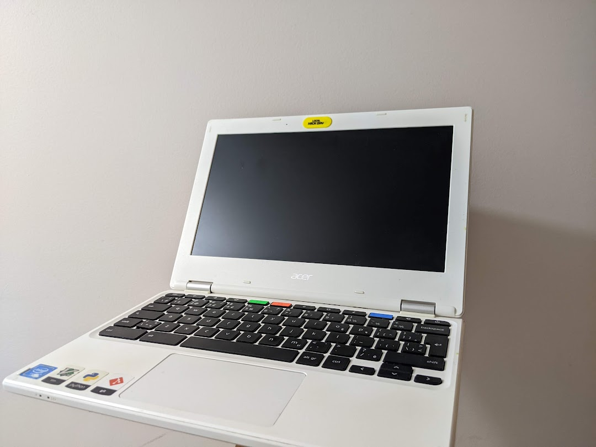

> /* work in progress */

My first text editor was the one used in my highschool intro to cs class, [geany](https://www.geany.org/) -- which is a wonderful lightweight development environment -- and is, in my opinion, an excellent first editor because of its' simple yet powerful interface, cross-platform compatibility, and support for most relevant languages.

# The Beginning

But, at the time, my laptop was a 11.6" chromebook with 16GB of eMMC storage and kitted out with a CPU less capable than most budget modern phones.
Needless to say it was quite the beast of a machine, and by beast I mean it was about as beastly as an anemic worm.

> Note the [unix stickers](https://www.stickermule.com/ca/unixstickers)

However, I really loved that thing; I had stickerbombed it and flashed it with [galliumOS](https://galliumos.org/) (a hacky process involving removing the physical [hardware write protect screw](https://chromium.googlesource.com/chromiumos/docs/+/master/write_protection.md)) as to get a full Linux environment. 
Also, the battery life was great and the minimal resources lead me to value efficient code and programs -- as well as push me into *really* using the terminal.

> I'm a fan of sticker-bombing my devices. It's like a graffiti tag, but for nerds. Someday I'll show off my current laptop's stickers, but it's still yet to be retired.

And so because of hardware limitations and a programming teacher ([Mr. Ark](http://arkiletian.com/cs1/about/)), who is a huge vim fan and didn't give us mice in the computer lab, I picked up vim.

# The Quest
> The process, from starting out with a premade one, to making my own, to neovim, and so forth.

# Enlightenment

> Talk about integration with other tools; Linux is my IDE. And talk about stability i.e. not touching the `.vimrc` for a while (commit frequency graph?)

## Why `neovim`?

- [grok vi](https://stackoverflow.com/questions/1218390/what-is-your-most-productive-shortcut-with-vim/1220118#1220118)

# Implements of Mass Destruction

> Some plugins and tools I like

