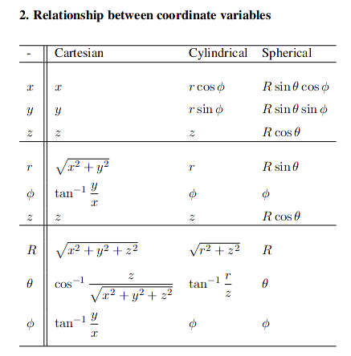
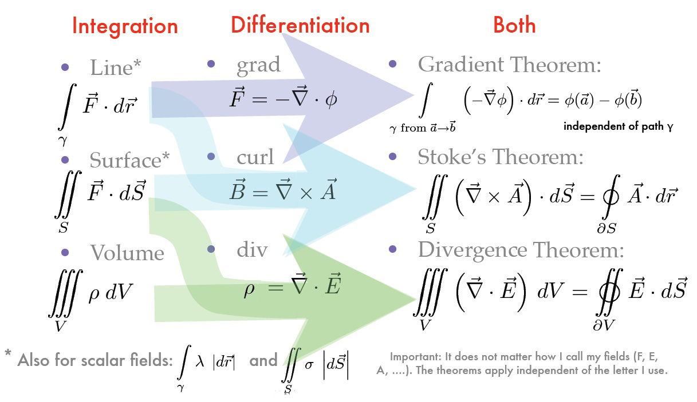
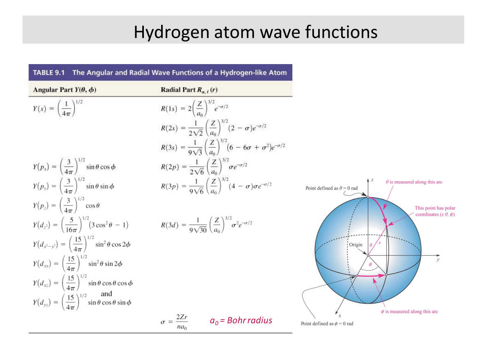



// Work in progress //

## TEP 327: Engineering and Law

Why do engineers need to know about law?  
- Engineering ends up stepping across a lot of jurisdictions, so we kinda need to know about it.

Law is ...
- very territorial: must note jurisdiction
  - Must develop intuition for jurisdiction (See [section 91]())
  - Generally:
    - Things outside of Canada & maintained *across* Canada -- Federal
    - Things that are managed within Canada and aren't necessarily consistent (local effect) -- Provincial
    - Things that Provincial gov. doesn't want to deal with -- Municipal (via mandate)
    - And for everything -- consider case law, etc.
- always dependent on context and subject to interpretation; the law's wording can stay constant but the interpretation can change over time
  - There are standard methods of interpretation (Living tree vs originalist, strict literal vs commercial reality/intentions)
  - Canada is bijural (both civil and common law)
    - Note difference between public (refers to society as a whole) and private law (individual interactions)

### Resources
- [Canadian Distribution of Legislative Powers](https://laws-lois.justice.gc.ca/eng/const/page-3.html)

## ECE286: Probability and Statistics

### Probability

#### Coin flip example & combining probabilities

Outcomes denoted by variables, i.e. for coin clip \\( H \\), \\( T \\). Probability of outcome is denoted by \\( P(X) \\), where \\( X \\) is the outcome. We must have \\( \sum(P) = 1 \\) since \\( 100% \\).

Suppose \\( P(H) = 0.3 \\) , \\( P(T) = 0.7 \\). 

Then, $$P(HT) = P(H)P(T) = 0.3 \times 0.7 = 0.21 $$ 
$$ P(HT) = P(H)P(T) = 0.3 \times 0.7 = 0.21 $$
$$ P(HT \text{ or  } TH) = P(H)P(T) + P(T)P(H) = \\\\ 0.3 \times 0.7 + 0.7 \times 0.3 = 0.42 $$

#### Sets and events

**Sample space**: set of a\ell possible outcomes.
E.x. 
- coin flip: \\( S = {H, T} \\)
- roll of a die: \\( S = {1,2,3,4,5,6} \\)
- roll of a die but only care even/odd: \\( S = {even, odd} \\)

**Event**: a subset of sample space  

For example, each element, \\(e \in S = {1,2,3,4,5,6} \\) are the elements of S for a die.

**Complement of an event A w.r.t. S**: everything in \\( S \\) and not \\( A \\), denoted \\( A' \\).  
Example: for a die, \\( {1, 2} \\) is the complement of \\( {3,4,5,6} \\)

**Intersection of two events**: everything in \\( A \\) *and* \\( B \\), denoted \\( A \cap B \\)

**Union of two events**: everything in \\( A \\) *or* \\( B \\), denoted \\( A \cup B \\)

#### Counting

**Multiplication Rule**: 
The total amount of outcomes is the product of the amount of outcomes in each event.
I.e. if for a sequence if \\( k \\) events \\( E_1, E_2, ..., E_k \\) with outcomes \\( S_1, S_2, ..., S_k \\)
then the total amount of outcomes is \\( \prod_{i=1}^k S_i \\)

**Permutations**: \\( n \\) distinct objects can be arranged in \\( n! \\) ways. When considering permuting a subset of size \\( r \\) taken from a set of size \\( n \\), the total number of arrangements is given by 

$$ nPr = \frac{n!}{(n-r)!} $$

If we can have repeated kinds, i.e. if there are \\( m \\) kinds of items and \\( n_k, k = 1, \dots m \\) of each kind, then there are 

$$ \frac{n!}{n_1!n_2!\dots n_m!}$$ permutations.

For example, we can order "ATLANTIC" \\( \frac{8!}{2!2!1!1!1!1!}  = 10080\\) times.

The same formula applies for finding the number of ways to arrange \\( n \\) items into \\( k \\) subsets of size \\( n_1, n_2, \dots , n_k \\)

**Combinations**: Permutations, but order doesn't matter.

$$ nCr = \binom{n}{r} = \frac{n!}{r!(n-r)!} $$

Note similarity to the partition formula; combinations can be thought as the set of partitions of size \\( 1 \\).

#### Additive Rules

For events A, B:
$$ P(A\cup B) = P(A) + P(B) - P(A\cap B)$$

For \\(  n \\) mutually exclusive events \\( A_1, A_2 ... A_n \\)
$$ P(A_1 \cup A_2 \cup ... A_n) = P(A_1) + P(A_2) + ... + P(A_n)$$

And if \\( A_1, A_2 ... A_n \\) is a partition of sample space S, 

$$ P(A_1 \cup A_2 \cup ... A_n) = P(A_1) + P(A_2) + ... + P(A_n)$$

And:
$$ P(A \cup B) + P(A) + P(B) $$

## ECE259: Electromagnetism

Electromagnetic field is a vector quantity given by a magnitude \\( E \\) and unit vector \\( \hat{a} \\), and is commonly found as the force exerted on a positive test charge \\( q \\).

$$ \vec{E}= E\hat{a}_E = \frac{\hat{F}}{q} = q\vec{E}$$

We can expand on this to find the force exerted by a point charge at varying distances \\( r \\) from the charge, noting that \\( k = \frac{1}{4\pi E_o}\\), where \\( E_o \\) is the permittivity of free space.

$$ \vec{E} = \frac{1}{k} \frac{q_{source}}{r^2} \hat{a}_e $$

and this can be further generalized for a system of charges that are not necessarily at the origin

$$ \vec{E_{sys}} = \frac{1}{k}\sum_k \frac{q_k}{|\vec{R}-\vec{R'_k}|^3}(\vec{R} - \vec{R'_k}) $$

### Vector Calculus Review

#### Coordinate Systems

**Cylindrical \\(( r_p, \phi_p, z_p)\\)**: 

**Note**: When adding vectors in non-Cartesian coordinate systems we cannot just add the components because the *direction* of the unit vectors can change.
> When adding vectors in non-Cartesian coordinate systems we must first convert the vectors to Cartesian coordinates

**Cylindrical -> Cartesian**:
$$ r_p = \sqrt{x_p^2 + y_p^2}  $$
$$ \phi_p = \arctan(y_p/x_p) $$
$$ z_p = z_p $$

**Cartesian -> Cylindrical**:
$$ x_p = r_p \cos(\phi_p) $$
$$ y_p = r_p \sin(\phi_p) $$
$$ z_p = z_p $$

**Spherical \\(( r_p, \theta_p, \phi_p)\\)**: 

> \\( \theta \\) gives angle w.r.t the z-axis, \\( \phi \\) gives angle w.r.t the x-axis

**Cartesian -> Spherical**:
$$ r_p = \sqrt{x_p^2 + y_p^2 + x_p^2}  $$
$$ \theta_p = \arccos{\frac{z}{\sqrt{x_p^2 + y_p^2 + z_p^2}  }}$$
$$ \phi_p = \arctan(y_p/x_p) $$

**Spherical -> Cartesian**:
$$ x_p = r_p \sin{\theta_p}\cos{\phi_p} $$
$$ y_p = r_p \sin{\theta_p}\sin{\phi_p} $$
$$ z_p = r_p \cos{\theta_p}$$

> From reference sheet

#### Integration

Multidimensional integration in different coordinate systems can largely be done just by finding the appropriate differential element and then inserting it into the appropriate formula.

- Line integrals:
$$ -\int_A^B{\vec{E} \cdot d \vec{l}} $$
> example application: finding potential difference

- Surface integrals:

$$ \int_S{\vec{D}\cdot d\vec{s}} $$
> Example application: finding flux, etc.
- Volume integrals:

$$\int_V{ P dV } $$
> example application: finding total charge

- Cartesian
$$ d\vec{l} = d_x\vec{a_x} + d_y\vec{a_y} + d_z \vec{a_z}  $$
$$ d\vec{s} = d_y d_z \vec{a_x} + d_x d_z \vec{a_y} + d_x d_y \vec{a_z} $$
$$ dV = d_xd_yd_z $$

- Cylindrical

$$ d\vec{l} = d_r\vec{a_r} + d_\phi \vec{a_\phi} + d_z\vec{a_z}$$
$$ d\vec{s} = r d_\phi d_z \vec{a_r} + d_r d_z \vec{a_\phi} + r d_\phi d_r \vec{a_z} $$
$$ dV = r d_\phi d_zd_r $$

- Spherical

$$ d\vec{l}  = d_R \vec{a_r} + Rd\theta \vec{a_\theta} + R\sin{\theta}d_\phi \vec{a_\phi} $$
$$ d\vec{s} = R^2\sin{\theta}d_\theta d\phi \vec{a_r} + R\sin{\theta}dRd\phi\vec{d_\phi} $$
$$ dV = R^2\sin{\theta}d_Rd_\theta d_\phi $$

A general approach for integration is as follows:
1. Choose a coordinate system
2. Determine which position coordinates vary during integrationa nd their ranges
3. Select the appropriate differential quantity, e.g. \\( d\vec{l} \\), \\( d\vec{s} \\), \\( dV \\), etc.
4. If the integrand is a vector, make sure that all unit vectors are constant during integration
5. Integrate over the appropriate limit

It is often useful to convert between types of integrals to make the process easier.
This can be done with the following theorems:

> [source](http://furqaanyusaf.com/notes/vectors/stokes-apply)

### Electric Fields

#### Continuous charge distribution

> Recall: \\( \vec{E_{sys}} = \frac{1}{4\pi\varepsilon_o}\sum_k \frac{q_k}{|\vec{R}-\vec{R'_k}|^3}(\vec{R} - \vec{R'_k}) \\)

In continuous form, \\( \int{d\vec{E}} \\)

## BME205: Introduction to Biomedical Engineering

> Textbook: Human Physiology From Cells to Systems, 5th Canadian Edition by Sherwood and Ward (ISBN-13 978-0-17-691235-2).

### Cells 
> Reference: Chapter 2

#### Components

- **Plasma Membrane**: lipid bilayer studded with proteins; acts as a selective barrier between inside of cell and outside world
- **Nucleus**: "Control center" of cell; genetic material (DNA in Chromosomes) storage
  - Chromatin
  - Nucleolus
  - Nuclear pores
  - Cisternae

- **Endoplasmic Reticulum**: Membranous network of fluid-filled tubules and flattened sacs studded with ribosomes; forms new cell components and materials for secretion
  - Rough Endoplasmic Reticulum
  - Smooth Endoplasmic Reticulum

- **Lysosome**: Sacs containing hydrolytic enzymes; "digestive system" of cell
- **Peroxisome**: Sacs containing oxidative enzymes; detoxification system
- **Centriole**: Barrel-shaped organelles composed of 9 short triplet microtubules; site of microtubule growth 
- **Microtubule**: slender and hollow tubes made of secretory vesicles; forms the mitotic spindle and aid in cellular transport
- **Mitochondria**: "Powerhouse of the cell": ATP production
- **Ribosome**: Workbenches for protein synthesis
- **Vesicle**: Transient membranous sacs for product transport
- **Microfilaments**: Intertwined chains of actin molecules (in muscles, myosin molecules) -- for cellular contractile systems
- **Intermediate Filaments**: Irregular threadlike proteins to resist mechanical stress
- **Cytoplasm**: Jelly-like "fluid" inside of cells

#### ATP

ATP (**A**denosine **T**ri**P**hosphate) enables cellular activity through the energy released from breaking the high-energy phosphate bonds it contains.

$$\text{ATP} \rightarrow \text{ADP} + \text{P} + \text{energy}$$

> *Anabolic* activities forms complex molecules from simple ones; *Catabolic* activities decompose complex molecules into simple ones.

#### DNA & Chromosomes

DNA is built up of nucleotides, each of which has three components: a nitrogenous base, a five-carbon sugar *deoxyribose*, and a phosphate group. 
These are linked together by hydrogen bonds between bases, which is highly specific: *adenine (A)*: *thymine (T)*,  *guanine (G)*: *cytosine (C)*.
A and G have double ring structures while C and T have single ring structures.

Chromosomes are made of DNA that has been "super coiled" (think: telephone cord). Humans have 23 pairs of chromosomes.

.

There are multiple ways that this can be packed, e.g. zigzag or solenoid patterns:

##### Replication

> Note: DNA is formed of two complimentary strands [(5', 3' strands)](https://en.wikipedia.org/wiki/Directionality_(molecular_biology)).

1. DNA is first split apart by proteins called **initiators** which look for *origin* base sequences
    - There are many origins along the DNA strand since it would take too long to split the DNA from just one point.
2. With the opening made, *helicase* enzymes gets to business to really start breaking the DNA apart. 
    - Think of a zipper being unzipped in two ways.
    - *Single-stranded binders* keep the DNA propped open and *gyrase* prevents it from torquing and knotting.
Then, the actual replication step takes place
1. A piece of temporary RNA bonds with the first nucleotide opened by helicase
2. *DNA polymerase* comes along and pairs up bases
3. After the bases are all put in, the temporary RNA is broken off and the DNA fragments are joined together by *ligase*
4. *proofreading DNA polymerase* goes along the DNA and checks for errors by looking for "bumps" in the structure
And then it is put into the chromosomal form
1. DNA is wrapped around histones & *telomeres* (single-sided pieces of "junk DNA" at the end) managed by trimming them to equal length in mitosis or being wrapped with RNA primer and *telomerase* enzyme in meiosis.

##### Gene Expression

> Why don't skin sprout eyeballs or livers grow toes?

Gene expression is the mechanism by which only the appropriate genes are called upon to produce the desired function.
Usually the default setting for gene expression is to be off.

Things that can impact gene expression:
- Enviromental factors (usu. heat/light)
- Genetic presets (e.g. some that are supposed to activate at certain stages of development; cues taken from cell or neighbouring cells)
- Hormones; chemicals produced by brain and glands

When a gene gets switched on it gets "transcribed" into a piece of *messenger RNA*, which is a single stranded nucleic acid which carries the information out of the nucleus and into the cell. 

> Note: RNA contains Uracil (U) instead of Thymine (T) as a compliment to Adenine (A).

A key property of RNA is its additional oxygenation, which makes it a lot more reactive.
This, combined with the fact that U can bond with all the other bases gives the ability for RNA to form complex non-linear shapes.

Another property of RNA is that it is is single-use; each piece of mRNA ceases functioning after it's task has been completed.

###### Transcription

## PHY294: Quantum and Thermal Physics

Useful tools:

**Planck's Equation**: photon energies \\( E = hv = \frac{hc}{\lambda} \\)   
**de Broglie wavelength**: relating momentum with wavelength \\( \lambda = \frac{h}{m v}\\)  
**Schrodinger's equation**:

$$ H\psi = E\psi $$

- \\( H \\) is the Hamiltonian, \\( \psi \\) is the wave function, and \\( E \\) is the energy.
- \\( |\psi|^2 \\) gives the probability density function.

Recall: for a 1D particle in a box we use \\( \psi = Asin(kx) + Bcos(kx)\\) and then we can apply the boundary conditions at the bounds of the box.
We may then find \\( \psi \\)) to be \\( \sqrt{\frac{2}{L}}sin()\frac{n\pi}{L})x\\) and \\( E_n = \frac{n^2h^2}{8mL^2} \\)) where \\( n \\)) is a integer > 0.

In 2D and 3D this is more complicated but the same idea follows.

When applying to a hydrogen atom it is useful to use spherical coordinates. 
The solution is a bit of work to write out, so [see this](https://chem.libretexts.org/Courses/University_of_California_Davis/UCD_Chem_107B%3A_Physical_Chemistry_for_Life_Scientists/Chapters/4%3A_Quantum_Theory/4.10%3A_The_Schr%C3%B6dinger_Wave_Equation_for_the_Hydrogen_Atom).

> Solutions from textbook. I think these would be provided if applicable.

Hydrogen orbitals can be written as \\( \psi(r, \theta, \phi) = R(r)\Theta(\theta)\Phi(\phi) \\).

1. We apply \\(  n = 1,2,3... \\) (quanta) to the hydrogen atom.
2. \\(  E = -\frac{E_r}{n^2} \\) **NOTE**: 1) Only applies to hydrogen 2) This is exactly the Rydberg/Bohr relation.
3. \\(  l = 0,1,2...(n-1)\\)

We can apply separation of variables to simplify the problem.

## ESC204: Praxis III

