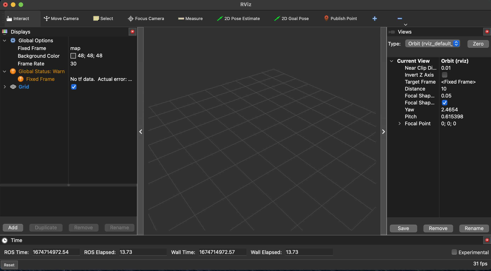
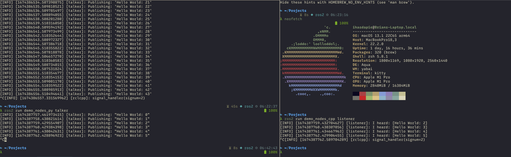

## It works! [^1]

[^1]: as of time of writing...

> I got a shiny new macbook and was sad that I had to dual-boot into Asahi (which is actually a surprisingly robust experience at the time of writing) to do ROS2 work. So I did the only sensible thing and spent the better part of a day making `ros2` build on an m1 mac on MacOS Ventura.


I'd like to report that `ros2` runs _flawlessly_ on apple silicon with some caveats (see below).
But for most use cases it's amazing to work with and ridiculously fast. For reference, building aUToronto's planning stack on my old i7-8550u laptop took between 5-10 minutes, Asahi 48 seconds, and _18.5_ seconds on MacOS!



> rviz!


> talker and listener in action


## Let's get started


I'm going to assume you've read [how to maintain a source checkout of ROS2](https://docs.ros.org/en/rolling/Installation/Maintaining-a-Source-Checkout.html) and are familiar with how to create a workspace and the folder structure and all that. If not -- go read it!


Here's the build command to use:


```bash
colcon build\ 
--mixin compile-commands ccache \ # optional, see https://github.com/colcon/colcon-mixin-repository
--event-handlers console_cohesion+ status+ summary+ terminal_title+ console_package_list+ \ # print things out nicer
--cmake-args --no-warn-unused-cli \
    -DPython_EXECUTABLE=/Users/PATH/TO/PYTHON/VENV/bin/python \ # modify this to suit your needs. Or just use $(which python3) if you have your virtualenv activated
    -DPython_FIND_VIRTUALENV=ONLY \
    -DCMAKE_FIND_FRAMEWORK=LAST \ # I don't recall the specific reason but it doesn't work without it. IIRC it had something to do with the system frameworks conflicting with the packages we are building and the pyenv python.
    -DBUILD_TESTING=ON \ # not needed. I wanted to make sure ros2 worked.
    -DINSTALL_EXAMPLES=ON \ # not needed as well. I wanted to make sure ros2 worked.
    -DCMAKE_BUILD_TYPE=RelWithDebInfo \ # Feel free to use Release
    -DCMAKE_OSX_SYSROOT=/Applications/Xcode.app/Contents/Developer/Platforms/MacOSX.platform/Developer/SDKs/MacOSX.sdk \
    -DCMAKE_OSX_ARCHITECTURES='arm64' \
    -DCMAKE_PREFIX_PATH=$(brew --prefix jsoncpp)/lib:$(brew --prefix qt@5):/opt/homebrew/Cellar/qt@5/5.15.8_1:/opt/homebrew/opt/boost/lib/cmake:/opt/homebrew \ # A bunch of these should actually be $(brew --prefix)/lib but anyhow...
    -DPYTHON_LIBRARY=/Users/YOUR_USERNAME/.pyenv/3.10.9/lib/libpython3.10.dylib \ # you will have to modify this with your username and python version
    -DPYTHON_INCLUDE_DIR=/Users/ihasdapie/.pyenv/versions/3.10.9/include/python3.10 \
```

> I like joining all of the above into a single line and making an alias for the build command. Please see comments in why the command is the way it is.


### 1. Use [direnv](https://direnv.net). It'll make your life easier.
### 2. Create a python virtual environment.
Don't use pipenv or poetry, they seem to work poorly with CMAKE. You will want to avoid using your system python but instead a python installed through `pyenv` to make this virtual environment. This is so to facilitate finding the correct python Framework and so forth.


```bash
 pyenv install 3.10.9 # this is just what I used
 pyenv global 3.10.9
 python3 -m venv .venv
```

### 3. Tell direnv to use the virtual environment

```bash
echo "source .venv/bin/activate" > .envrc
direnv allow
```

### 4. Install python dependencies

```bash
# We need numpy headers
python -m pip install numpy --no-binary=:all:
python3 -m pip install -U argcomplete catkin_pkg colcon-common-extensions coverage cryptography empy flake8 flake8-blind-except flake8-builtins flake8-class-newline flake8-comprehensions flake8-deprecated flake8-docstrings flake8-import-order flake8-quotes ifcfg importlib-metadata lark-parser lxml mock mypy==0.761netifaces nose pep8 pydocstyle pydot "pyparsing>=2.4,<3" pytest-mock rosdep setuptools vcstool matplotlib psutil rosdistro
```
> For reference a `pip freeze` on my system gives [requirements.txt](requirements.txt)

### 5. Deal with graphviz

You will likely run into a complant about graphviz. `brew install graphviz` 
```bash
pip install --global-option=build_ext --global-option="-I$(brew --prefix graphviz)/include/" --global-option="-L$(brew --prefix graphviz)/lib/" pygraphviz
```

You may need to run step 4 again after doing this.

### 6. System dependencies

> I probably missed some, but this is what I recall installing. Some might be for some other packages I needed. Please let me know if I missed something.

``` bash

brew install freeimage pcl opengl gpsd gpatch

```

- Need to use gpatch instead of macos's built in `patch` command because a lot of the patches applied to vendored packages fail when using MacOS's patch. Don't ask why, I wouldn't know.


### 7. Install some patched brew packages

This may not apply to you if you aren't depending on `jsoncpp` or `boost` -- but if you are -- there are a few versioning things and other issues that need to be patched. I've created a tap for this. You will need the fixed `Boost` packages to build most of the perception packages.
In any case, on my current system (Ventura 13.1) the system python at time of writing is 3.10.9 and the `boost-python3` version from homebrew is complaining (since it is built for python3.11).

```bash
brew tap ihasdapie/formulas https://github.com/ihasdapie/formulas
brew install ihasdapie/formulas/boost
brew install ihasdapie/formulas/jsoncpp
brew install ihasdapie/formulas/boost-python3
```
### 8. Patch `python_cmake_module`

There's this absurd issue where `python3-config --ldflags` doesn't work properly. To get around it I hardcoded a patch pointing it to the absolute path on my system.
You will have to change <USERNAME> and your python version.

```diff
diff --git a/cmake/Modules/FindPythonExtra.cmake b/cmake/Modules/FindPythonExtra.cmake
index 9e18f83..16af911 100644
--- a/cmake/Modules/FindPythonExtra.cmake
+++ b/cmake/Modules/FindPythonExtra.cmake
@@ -101,6 +101,7 @@ if(PYTHONINTERP_FOUND)
           "error code ${_result}")
       endif()
 
+      set(_output "-L/Users/<USERNAME>/.pyenv/versions/3.10.9/lib/python3.10/config-3.10-darwin -lpython3.10 -ldl -framework CoreFoundation")
       string(REPLACE " " ";" _output_list "${_output}")
       set(PythonExtra_LIBRARIES
         ""
```

### 8. Deal with `Qt`

Make sure Homebrew qt isn't installed or at least unlink it (CMake gets confused) since homebrew qt is qt6 now. `brew install qt@5` instead, you will need this for `rviz_rendering`.
For some godforsaken reason you will have to bump this to the top of the PATH for CMake to pick up properly. If a Qt-related package fails try `export PATH="/opt/homebrew/opt/qt@5/bin:$PATH"`, wiping `build/rviz_rendering`, building again if this issue happens.

After getting past `rviz_rendering` you might be lulled into a false sense of security.
Fear not, for `Qt` will rear its ugly head again soon.
The Homebrew `qt@5` package is kind of a mess and will look for `mkspecs` and `plugins` at an almost malformed path. Fortunately there's an easy workaround via symlinking.

```bash
ln -s opt/qt@5/mkspecs /opt/homebrew/mkspecs
ln -s /opt/homebrew/Cellar/qt@5/5.15.8_1/plugins /opt/homebrew/plugins
```
You may have to change the qt version depending on what you have.


### 9. Deal with Ogre

This package pulls in a vendored package. You will have to build once, let it fail, _then_ patch the package living in `build/rviz_ogre_vendor`, _then_ build again

```diff
diff --git a/CMakeLists.txt b/CMakeLists.txt
index faac7e1b..c36877c3 100644
--- a/CMakeLists.txt
+++ b/CMakeLists.txt
@@ -120,7 +120,7 @@ macro(build_ogre)
     set(OGRE_CXX_FLAGS "${OGRE_CXX_FLAGS} /w /EHsc")
   elseif(APPLE)
     set(OGRE_CXX_FLAGS "${OGRE_CXX_FLAGS} -std=c++14 -stdlib=libc++ -w")
-    list(APPEND extra_cmake_args "-DCMAKE_OSX_ARCHITECTURES='x86_64'")
+    list(APPEND extra_cmake_args "-DCMAKE_OSX_ARCHITECTURES='arm64'")
   else()  # Linux
     set(OGRE_C_FLAGS "${OGRE_C_FLAGS} -w")
     # include Clang -Wno-everything to disable warnings in that build. GCC doesn't mind it
```
> Above patch is for `rviz_ogre_vendor`. You just need to tell it to build for arm64.


```diff
--- build/rviz_ogre_vendor/ogre-v1.12.1-prefix/src/ogre-v1.12.1/OgreMain/include/OgrePlatformInformation.h.orig	2021-06-02 16:28:58.000000000 -0400
+++ build/rviz_ogre_vendor/ogre-v1.12.1-prefix/src/ogre-v1.12.1/OgreMain/include/OgrePlatformInformation.h	2021-06-02 16:30:50.000000000 -0400
@@ -50,11 +50,11 @@
 #   define OGRE_CPU OGRE_CPU_X86

 #elif OGRE_PLATFORM == OGRE_PLATFORM_APPLE && defined(__BIG_ENDIAN__)
 #   define OGRE_CPU OGRE_CPU_PPC
 #elif OGRE_PLATFORM == OGRE_PLATFORM_APPLE
-#   define OGRE_CPU OGRE_CPU_X86
+#   define OGRE_CPU OGRE_CPU_ARM
 #elif OGRE_PLATFORM == OGRE_PLATFORM_APPLE_IOS && (defined(__i386__) || defined(__x86_64__))
 #   define OGRE_CPU OGRE_CPU_X86
 #elif defined(__arm__) || defined(_M_ARM) || defined(__arm64__) || defined(__aarch64__)
 #   define OGRE_CPU OGRE_CPU_ARM
 #elif defined(__mips64) || defined(__mips64_)
```

> Above patch is for the vendored package (lives in `build/`)


### 10. Deal with `orocos`

We need to build a few more packages from source and patch a ton of packages. I think there's a missing dependency export or something not propagating properly...but I haven't looked it through.

```bash
git clone https://github.com/orocos/orocos_kinematics_dynamics --recurse-submodules src/orocos_kinematics_dynamics
```


Perform the following patches:


```diff
diff --git a/orocos_kdl/CMakeLists.txt b/orocos_kdl/CMakeLists.txt
index a1b335c..721494a 100644
--- a/orocos_kdl/CMakeLists.txt
+++ b/orocos_kdl/CMakeLists.txt
@@ -13,6 +13,7 @@ CMAKE_MINIMUM_REQUIRED(VERSION 3.0.2)
PROJECT(orocos_kdl)

SET( KDL_VERSION 1.5.1)
+SET( CMAKE_CXX_STANDARD 11)
STRING( REGEX MATCHALL "[0-9]+" KDL_VERSIONS ${KDL_VERSION} )
LIST( GET KDL_VERSIONS 0 KDL_VERSION_MAJOR)
LIST( GET KDL_VERSIONS 1 KDL_VERSION_MINOR)
```

```diff
diff --git a/orocos_kdl/CMakeLists.txt b/orocos_kdl/CMakeLists.txt
index a1b335c..721494a 100644
--- a/orocos_kdl/CMakeLists.txt
+++ b/orocos_kdl/CMakeLists.txt
@@ -13,6 +13,7 @@ CMAKE_MINIMUM_REQUIRED(VERSION 3.0.2)
PROJECT(orocos_kdl)

SET( KDL_VERSION 1.5.1)
+SET( CMAKE_CXX_STANDARD 11)
STRING( REGEX MATCHALL "[0-9]+" KDL_VERSIONS ${KDL_VERSION} )
LIST( GET KDL_VERSIONS 0 KDL_VERSION_MAJOR)
LIST( GET KDL_VERSIONS 1 KDL_VERSION_MINOR)
```

```diff


diff --git a/kdl_parser/package.xml b/kdl_parser/package.xml
index 39a02d2..08baa3c 100644
--- a/kdl_parser/package.xml
+++ b/kdl_parser/package.xml
@@ -23,6 +23,7 @@
   <buildtool_depend>ament_cmake_ros</buildtool_depend>
 
   <depend>orocos_kdl_vendor</depend>
+  <depend>orocos_kdl</depend>
   <depend>rcutils</depend>
 
   <build_depend>urdf</build_depend>
   ```

```diff

diff --git a/tf2_kdl/package.xml b/tf2_kdl/package.xml
index b8ef997..e7b7a98 100644
--- a/tf2_kdl/package.xml
+++ b/tf2_kdl/package.xml
@@ -16,6 +16,7 @@
   <depend>builtin_interfaces</depend>
   <depend>geometry_msgs</depend>
   <depend>orocos_kdl_vendor</depend>
+  <depend>orocos_kdl</depend>
   <depend>tf2</depend>
   <depend>tf2_ros</depend>
 
```

By now you probably get the gist of it -- you'll also have to add a `<depend>orocos_kdl</depend>` to `tf2_geometry_msgs`


### 11. Fix `pybind11_vendor`

Disable the windows patch since we're building to macos and bump pybind11 to a newer commit with fixes for python3.11
```diff
```diff

diff --git a/CMakeLists.txt b/CMakeLists.txt
index 309a628..f940ae0 100644
--- a/CMakeLists.txt
+++ b/CMakeLists.txt
@@ -55,7 +55,7 @@ macro(build_pybind11)
   include(ExternalProject)
   ExternalProject_Add(pybind11-2.9.1
     GIT_REPOSITORY https://github.com/pybind/pybind11.git
-    GIT_TAG ffa346860b306c9bbfb341aed9c14c067751feb8  # v2.9.1
+    GIT_TAG 42a8e3125348d4e706e46eb410befc1422d42b3f  # v2.9.1
     GIT_CONFIG advice.detachedHead=false
     # Suppress git update due to https://gitlab.kitware.com/cmake/cmake/-/issues/16419
     # See https://github.com/ament/uncrustify_vendor/pull/22 for details
@@ -72,9 +72,6 @@ macro(build_pybind11)
     # definitions for Py_DEBUG, which MSVC complains about.  This patch switches
     # the internal pybind11 variable to be called PYBIND11_DEBUG, which avoids
     # the issue.
-    PATCH_COMMAND
-      ${CMAKE_COMMAND} -E chdir <SOURCE_DIR> git apply -p1 --ignore-space-change --whitespace=nowarn
-        ${CMAKE_CURRENT_SOURCE_DIR}/pybind11-2.9.1-fix-windows-debug.patch
   )
 
   # The external project will install to the build folder, but we'll install that on make install.
```


### 12. `ros-control/realtime_tools`

I needed this package but IIRC it's not in the `ros2.repos` file. This package uses a syscall not supported on macos -- here's a patch to fix it

```diff
diff --git a/src/thread_priority.cpp b/src/thread_priority.cpp
index 72749e3..4efadb9 100644
--- a/src/thread_priority.cpp
+++ b/src/thread_priority.cpp
@@ -50,7 +50,11 @@ bool configure_sched_fifo(int priority)
   struct sched_param schedp;
   memset(&schedp, 0, sizeof(schedp));
   schedp.sched_priority = priority;
-  return !sched_setscheduler(0, SCHED_FIFO, &schedp);
+#if defined(__APPLE__)
+  return !pthread_setschedparam(pthread_self(), SCHED_FIFO, &schedp);
+#else
+  return !sched_setscheduler(p, SCHED_FIFO, &schedp);
+#endif
 }
 
 }  // namespace realtime_tools
```


## Caveats
1. I cannot confirm if rqt tools work. This is because I did everything with python3.10 but it appears that PySide2 does not support Python3.10. I'm trying to build it from source but have not found success. If this is a must for you, you may have to run them on Asahi.
    1.  UPDATE: I'm now able to build everything except for `qt_gui_cpp` and `rqt_gui_cpp` on Monterey. It appears that [these patches](https://github.com/ros-visualization/python_qt_binding/issues/103#issuecomment-1235401057) should fix it, but I haven't tried it out yet.
    2. UPDATE: bizarrely it appears to build If I build specifically in the following order:
        1. `--packages-above python_qt_binding --packages-skip-by-dep qt_gui_cpp rqt_gui_cpp`
        2 `--packages-above python_qt_binding`
    2. homebrew `PySide2` appears to be not working in some way. Also current pyside for Qt5 don't explicitly support Python3.10+, so let's patch and build it from source.
        1. Make sure you have `clang` and `llvm` installed. 
        2. Apply patches [1](https://code.qt.io/cgit/pyside/pyside-setup.git/commit/sources/shiboken2/libshiboken/pep384impl.cpp?h=v5.15.2.1&id=298cfb2d4a9674ed00b3769fa396a292c075c51c), [2](https://code.qt.io/cgit/pyside/pyside-setup.git/commit/sources/shiboken6/libshiboken/pep384impl.cpp?id=81e9cff884d6b03cdf64a5dd6ec6564d99177e0c), [3](https://raw.githubusercontent.com/FreeCAD/homebrew-freecad/8944b8b362c7fd87c515efb07eb0fb022e946610/patches/libshiboken-numpy-1.23.compat.patch), 
        3. `export PATH="/opt/homebrew/opt/llvm/bin:$PATH"`
        4. `python3 setup.py build --qmake=$(which qmake)`
        5. Now this fails at not being able to find `qapp_macro.h`. // Work in progress //


2. c++20 support is [patchy](https://en.cppreference.com/w/cpp/20) at best in AppleClang, which may be a concern if your project is on `c++-20`. You can also use `g++` by installing it with homebrew and then adding these variables to your `.envrc`

```bash
export CXX=$(which aarch64-apple-darwin22-g++-12)
export CC=$(which aarch64-apple-darwin22-gcc-12)
```

