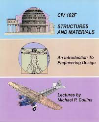

# "The only three rules an engineer needs to learn and remember"

1. \\( F = ma \\)
2. You can't push on a rope.
3. To get the answer, you must first know the answer

> [Michael P. Collins](https://civmin.utoronto.ca/home/about-us/directory/professors/michael-collins/)  [^c]

If I remember anything from my degree it might be the above three laws and the pursuit of *elegance* in design [^1]

[^1]: ...and maybe the various types concrete aggregates used in the [pantheon](https://en.wikipedia.org/wiki/Pantheon,_Rome)
[^c]: We were fortunate enough to be the last cohort to take it under Prof. Collins.

[source](https://skulepedia.ca/wiki/Three_Rules_of_Engineering)
